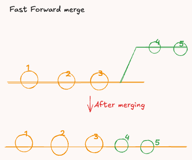
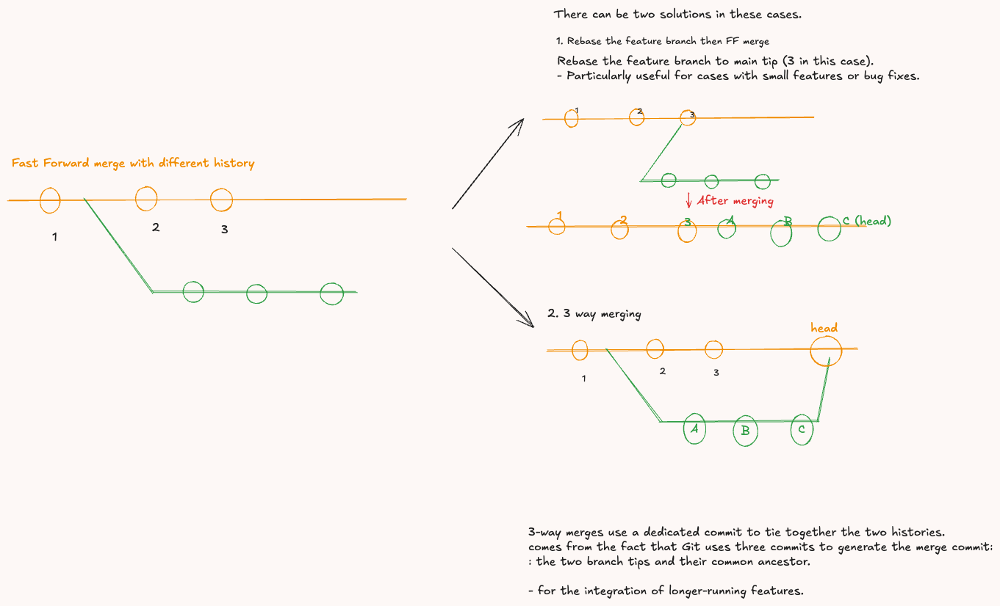
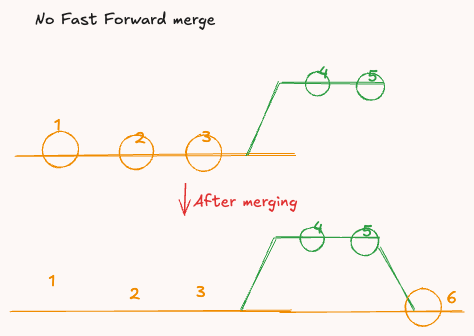
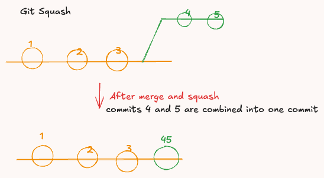

# Git Merging Concepts

These are some of my notes while learning different git merging concepts.
This repository contains a simplified guide to understanding Git branching and merging strategies. These notes were created to visualize and explain different scenarios you may encounter while working with Git. Whether you're brushing up on the basics or diving deeper, this guide aims to make these concepts easier to understand.

---

## Contents

1. [Fast Forward Merge](#1-fast-forward-merge)  
2. [Different History Scenarios](#2-different-history-scenarios)  
   - [Rebase](#a-rebase)  
   - [Three-Way Merge](#b-three-way-merge)  
3. [No Fast Forward Merge](#3-no-fast-forward-merge)  
4. [Squash Merge](#4-squash-merge)

---

## 1. Fast Forward Merge

A **fast-forward merge** occurs when Git moves the current branch tip to the target branch tip. This only works if the current branch has no additional commits after the branch point, resulting in a **linear history**.

---

## 2. Different History Scenarios

If the branches have diverged, a fast-forward merge is **not possible** because there is no linear path between them. In such cases, you can use one of the following strategies:

### a. Rebase

Rebase rewrites the commit history of the feature branch by applying its changes onto the base branch, resulting in a clean, **linear history**. However, this rewrites commit IDs, which can cause issues when working with shared branches.

**Pros:**  
- Cleaner history.  
- Easier-to-read logs.

**Cons:**  
- Not recommended for shared branches.  

---

### b. Three-Way Merge

A **three-way merge** combines the current branch, the target branch, and their common ancestor into a new commit. This preserves the history of both branches and introduces a **merge commit**.

**Pros:**  
- Preserves the history of both branches.  
- Safer for collaboration.

**Cons:**  
- Results in a non-linear commit history.  

---

## 3. No Fast Forward Merge

A **no fast-forward merge** is explicitly enforced to preserve the history of a branch, even when a fast-forward merge is possible. This introduces a **merge commit**, making the history clearer for feature or release branches.

**Pros:**  
- Explicit branch history.  
- Useful for feature or release workflows.

**Cons:**  
- Non-linear history.  

---

## 4. Squash Merge

A **squash merge** combines all the commits from a feature branch into a single commit on the base branch. This simplifies the history but removes the granular details of individual commits.

**Pros:**  
- Cleaner history with fewer commits.  
- Ideal for combining many small or incomplete commits.

**Cons:**  
- Loses the detailed history of individual commits.  

